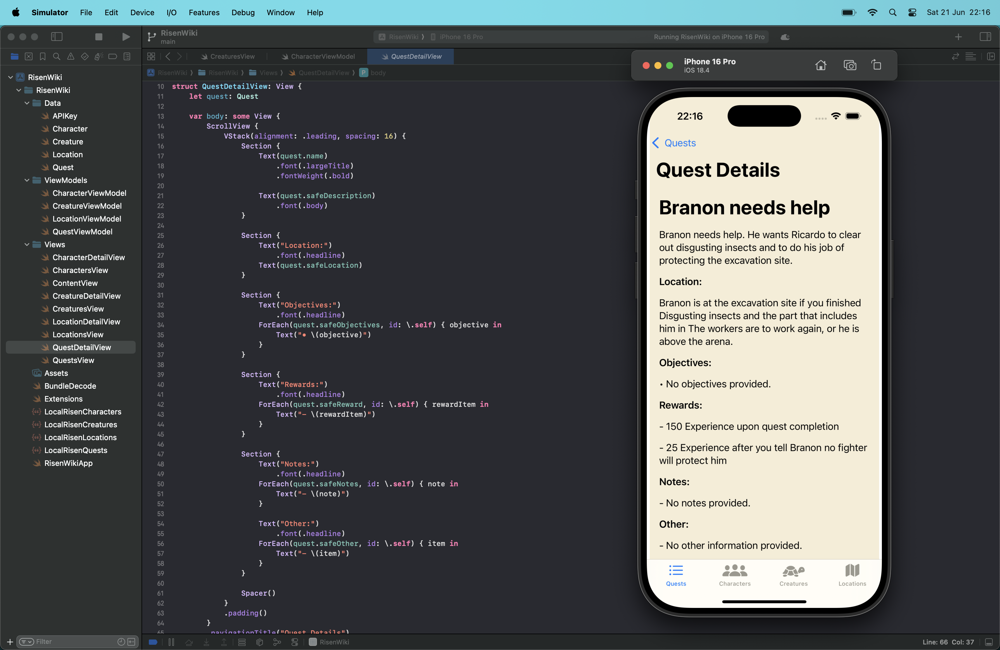
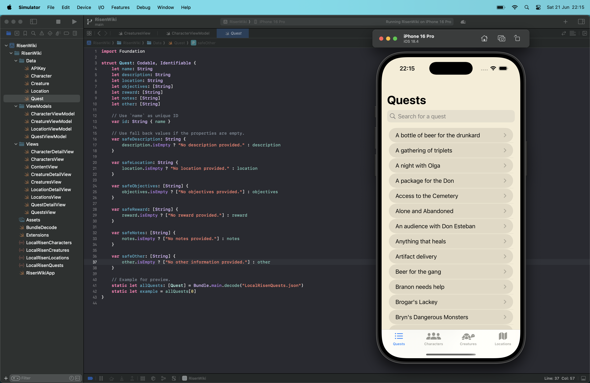

# RisenWiki

A fan-made companion app for the game **Risen** based on the [Risen Wiki website](https://risen.fandom.com/wiki/RISEN_Wiki) built in **SwiftUI** for iOS.  
RisenWiki helps players browse and search for information about creatures, locations, characters, and quests within the game world.

---

## Features

- ✅ View a list of all creatures, characters, locations, and quests.
- ✅ Search functionality for quickly finding entries.
- ✅ Detailed view for each creature with:
  - Description
  - Location
  - Encounters
  - Tactics
  - Statistics
  - Rewards

- ✅ Detailed view for each character with:
  - Description
  - Location
  - Related quests
  - Tips
- ✅ Detailed view for each quest with:
  - Description
  - Location
  - Objectives
  - Rewards
  - Notes
  - Other
- ✅ Load data from a remote API (if available) or fall back to bundled local JSON files.
- ✅ Elegant parchment-inspired UI theme.
- ✅ Modular, testable, and previewable SwiftUI views.

---

## Tech Stack

- **Language:** Swift
- **UI Framework:** SwiftUI
- **Concurrency:** Swift Concurrency (`async/await`)
- **Data:** JSON files (local + optional remote API)
- **Architecture:** MVVM

---

Disclaimer
This is an unofficial fan project for personal and educational purposes.
Risen is a trademark of Piranha Bytes / Deep Silver.
No assets from the original game are used or distributed.

